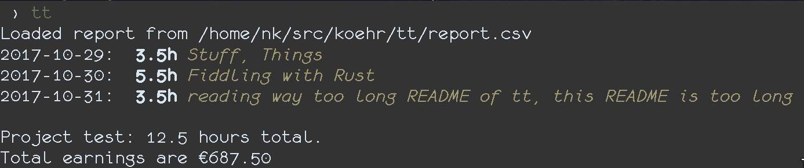

tt – track time
===============

Minimalist, manual time tracker. It gives you a helping hand and some colorful output to track your hours in a simple CSV file `report.csv`. This file is currently loaded/written in the current working directory. This way you can keep files on a per project basis in different directories.

screenshot
----------



Usage
-----

Lets assume a `report.csv` with following content:

```csv
2017-10-20,2.0,"Setting things up"
2017-10-20,3.0,"Fiddling with Rust"
2017-10-21,4.0,"Fiddling with Rust"
```

Without commands, `tt` prints the current report (same as `tt report`):

```
% tt
Loaded 3 awesome entries!
2017-10-20:  5.0h Setting things up, Fiddling with Rust
2017-10-21:  4.0h Fiddling with Rust
```

`tt all` prints all entries:

```
% tt all
Loaded 3 awesome entries!
2017-10-20:  2.0h Setting things up
2017-10-20:  3.0h Fiddling with Rust
2017-10-21:  4.0h Fiddling with Rust
```

`tt add` adds a new entry. This can happen directly via arguments:

```
% tt add 3 Reading about Rusts lifetimes
Loaded 3 awesome entries!
1 entries added

% tt
Loaded 4 awesome entries!
2017-10-20:  5.0h Setting things up, Fiddling with Rust
2017-10-21:  7.0h Fiddling with Rust, Reading about Rusts lifetimes
```

or you can add multiple entries at once via stdin:

```
% tt add
Loaded 4 awesome entries!
Add entries line by line like ‘2.5 foo bar baz’ and press CTRL+d when finished
1.5 Reading about Rusts lifetimes
2 Reading about Mickey Mouse
<CTRL+d>
2 entries added
report.csv updated

% tt
Loaded 6 awesome entries!
2017-10-20:  5.0h Setting things up, Fiddling with Rust
2017-10-21: 10.5h Fiddling with Rust, Reading about Rusts lifetimes, Reading about Mickey Mouse
```

planned features
----------------

Currently editing and deleting of entries has to be done manually. I thought about an _edit mode_, that makes this more handy.

The default output of `tt` and `tt report` condenses single entries to one line per day. I want condense it further so that for older entries only a summary for the whole month is shown if there is more than one month. Maybe even so much that only the last 5 days or so are shown (but usually the whole current month is of interest).

Projects! The tool should be able to distinguish between projects. A configuration file could hold projects with paths to reports and maybe some formatting rules?

build
-----

There are no packages, yet. To "install", you need [Rust](https://www.rustup.rs/). I develop `tt` on nightly but it might just work fine with stable.

If you've installed Rust and Cargo (installed with Rustup), you can build tt yourself:

```sh
git clone https://github.com/nkoehring/tt.git
cd tt
cargo build --release
```

You'll find the program in `./target/release/`. You can "install" it by putting it into your $PATH. If you have a local bin folder, then you'd do for example:

```sh
cp target/release/tt ~/.local/bin/tt
```

Or use a link:

```sh
cd ~/.local/bin/
ln -s /path/to/tt/target/release/tt tt
```
